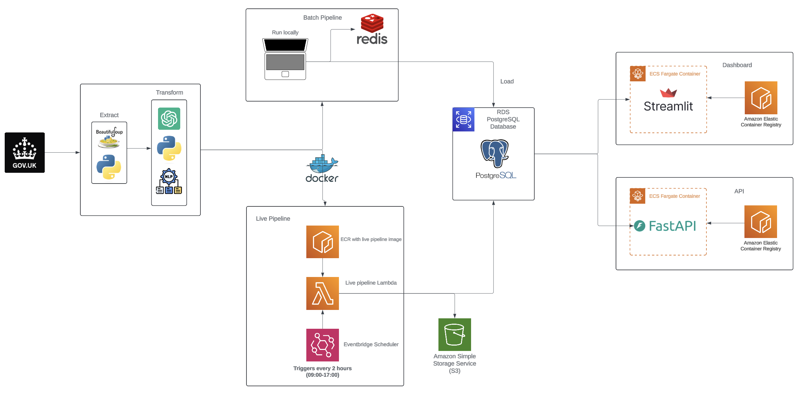

<div align="center">
  
<br/><br/>


# :scroll: JUSTICELENS: A Court Transcripts Pipeline Project :scroll:
</div>
&nbsp;


## :memo: Project Description

The (UK) National Archives release transcripts of real court hearings every day in plain text on the [National Archives website](https://caselaw.nationalarchives.gov.uk/). Due to both the large quantity of court transcripts as well as as the complexity of a typical law case, this data is difficult to consume and understand for the average person. 

We aim to solve this problem through our Court Transcripts Pipeline Project where we have built an automated data pipeline that collects information about both prior and new court cases and their respective information and insights.

The key deliverables of this project are summarised below:

- A batch data pipeline to collect prior court case data from previous cases.

- A live data pipeline that collect new court case data for newly added court cases not added by the batch pipeline.

- A live dashboard with a user friendly user interface to create and view relevant graphs and charts from the collective court data as well as lookup individual case details.

- A Email subscription service to allow users to receive notifications when a new court case is uploaded matching their selected preference(s) of court type.

- A RESTful API with searching via query parameters that provides the collected the data as raw json for developers to further utilise and manipulate data without requiring a pipeline of their own.


## 📂 Repository Contents

- `/api/`: Contains the API implementation and related files.
  
- `/database/`: Contains database-related files including database schema and seeding.
  
- `/pipeline/`: Contains the data pipeline scripts for the live and batch pipelines and related files.

- `/terraform/`: Contains terraform files for cloud deployed deliverables to provision and manage the cloud infrastructure required for the project.

- `/github/workflows/`: Contains GitHub Actions workflows.
  
- `.gitignore`: Git ignore file to specify untracked files to ignore.
  
- `README.md`: This file, providing an overview of the project.

## 🛠️ Installation

Please see the respective folders for setup instructions regarding individual components. The dependencies of the project deliverables is summarised below.


                                    +-------------------------+
                                    |        Database         |
                                    +-------------------------+
                                         /               \
                                        /                 \
                        +-------------------+         +-------------------+
                        |   Live Pipeline   |         |  Batch Pipeline   |
                        +-------------------+         +-------------------+
                                        \                 /
                                         \               /
                                    +-------------------------+
                                    |      Complete Data      |
                                    |  (Requires BOTH Live &  |
                                    |    Batch Pipelines)     |
                                    +-------------------------+
                                         /               \
                                        /                 \
                        +-------------------+         +-----------------+
                        |     Dashboard     |         |      API        |
                        +-------------------+         +-----------------+


### Basic Setup Instructions

The batch pipeline, live pipeline, dashboard, and API all require Python 3 and their own dependencies to function. Follow the steps below to set up the project:

### Cloning the Repository

First, clone the repository to your local machine:

```sh
cd ~
git clone https://github.com/yourusername/court-transcripts-pipeline.git
cd court-transcripts-pipeline
```

### Creating a Virtual Environment
We recommended to use a virtual environment to manage dependencies. Create and activate a virtual environment using the following commands:

On macOS and Linux:

```sh
python3 -m venv .venv
source .venv/bin/activate
```

### Installing Dependencies
Once the virtual environment is activated, install the required dependencies for each component using the requirements.txt file:

```sh
pip3 install -r api/requirements.txt
pip3 install -r pipeline/requirements.txt
pip3 install -r dashboard/requirements.txt
```
You should now have all the required python libraries to run the full court transcripts pipeline.

## :bar_chart: Project Architecture Diagram

A high level overview of the architecture and frameworks used in this project is summarised in the below architecture diagram:



## 👥 Authors

This project was made with :heart: and lots of :coffee: by the following contributors:

[Linfan Siddiqi](https://github.com/LinfanS)

[Miles Drabwell](https://github.com/MilesDrabwell)

[Anna Camplani](https://github.com/annac02)

[Hamoodi Al-Abbas](https://github.com/alabbahs)
