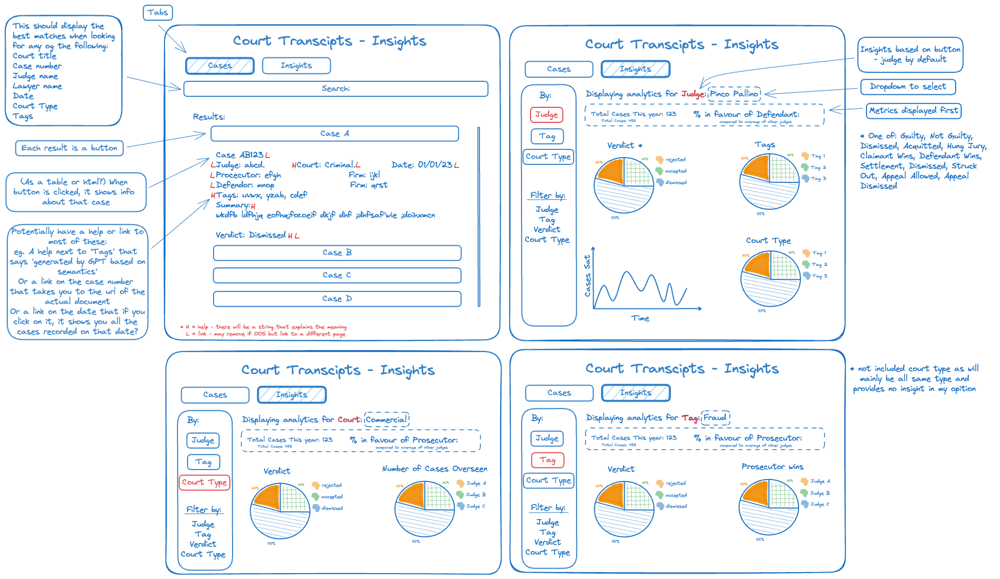

# Court Transcript Dashboard

## Viewing
To view this dashboard, if not done so already, please make sure you have all the requirements installed. 
This can be done by running `pip3 install -r requirements.txt` in the terminal; and is recommended to be done in a virtual environment.
The dependencies include:
```python
streamlit # framework used to create, interact with and display the dashboard
altair # visualisation library used to build the graphs and pie charts
pandas # data analysis and manipulation tool used to manipulate the data if needed
psycopg2-binary # package used that enabled us to connect to out database
python-dotenv # tool that reads key-value pairs from a .env file and sets them as environment variables
```
To view the dashboard in browser, either connect to the link provided in this repo []
or run the command `streamlit run dashboard.py` in your terminal. The latter will require the following environment variables of a database:
(we recommend you save these in a **local** .env file)
```python
DB_HOST #the endpoint to your (RDS) database
DB_PORT #port number that you want to connect to
DB_NAME #name of your database
DB_USER #your username
DB_PASSWORD #your password
```

## What to expect
- Wireframe
- Graphs and why
- Subscriptions

## Wireframe



## Insights from the dashboard


## Other implementations and features
