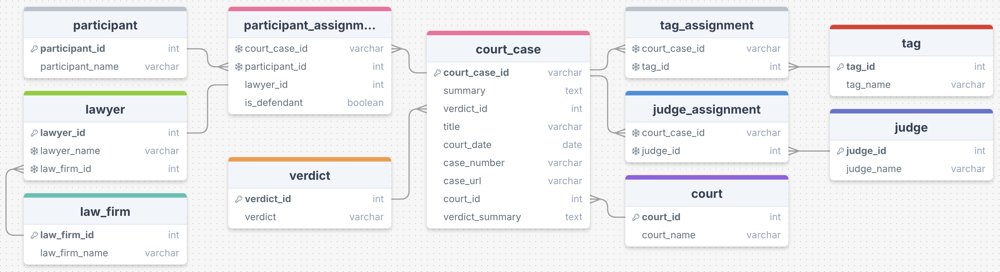

# Database Documentation
This folder contains the scripts and resources for setting up the database for the court transcript data pipeline.

## 📚 Folder Contents

- `judges_seed.py`: Script to seed the database with judge names data.

- `schema.sql`: SQL schema for the database.

- `requirements.txt`: Libraries needed to run judges_seed.py.

- `test_judges_seed.py`: Tests the functions in judges_seed.py.

## 🛠️ Database Setup Instructions

First to set up the database on AWS, go to the terraform folder and run:

```bash 
terraform apply db.tf
```

Then run these terminal commands back in the database folder:

```bash
psql -f schema.sql -h db-host -p db-port -d db-name -U db-user

pip3 install -r requirements.txt

python3 judges_seed.py
```

## ERD Diagram



